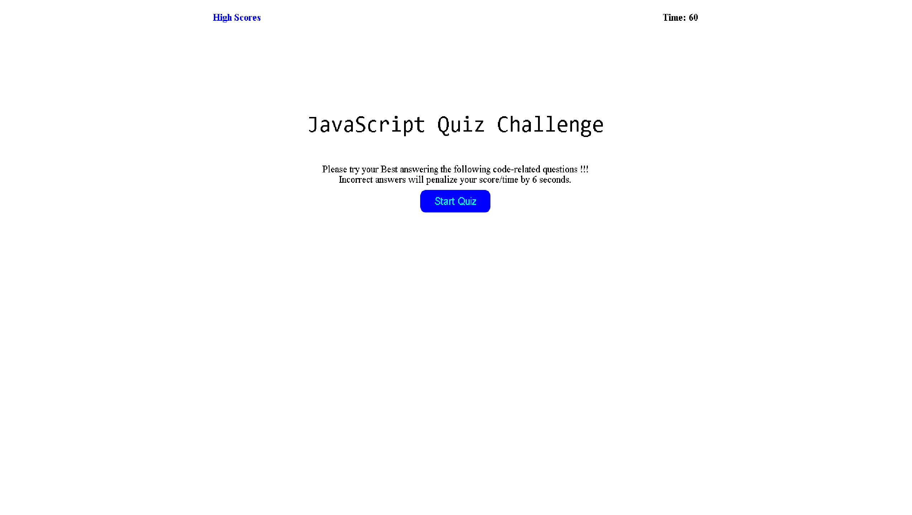

# JavaScript-Coding-Quiz
https://joemogy.github.io/JavaScript-Coding-Quiz/
## 02 Advanced CSS: Portfolio
https://joemogy.github.io/JavaScript-Coding-Quiz/
## Description
Short discription

## Tests

This challenge consists in creating a timed quiz with a highscore board:

When clicks on the button to start quiz, the timer starts and the user is presented with a question
When a question is answered, another question comes after.
If the answer is correct, the timer will continue to run, if the answer is incorrect there will be a timer penalty of 6 sec
When all questions are answered or timer reaches to 0, the game is over and then the user can save his initials and score
When resize the page or view the site on various screens and devices, is presented with a responsive layout that adapts to my viewport
##live Link

-https://joemogy.github.io/JavaScript-Coding-Quiz/
https://joemogy.github.io/JavaScript-Coding-Quiz/
  
## Installation

download from repo via zip, http, ssh.

HTTP
git@github.com:joemogy/JavaScript-Coding-Quiz.git

SSH
git@github.com:joemogy/JavaScript-Coding-Quiz.git

extract 

## Usage

HTTP
https://github.com/joemogy/JavaScript-Coding-Quiz.git

SSH
git@github.com:joemogy/JavaScript-Coding-Quiz.git

git pull

Screenshot

##Credits
  https://eloquentjavascript.net/
  https://www.w3schools.com/html/default.asp
  https://www.w3schools.com/css/css_howto.asp
  https://coding-boot-camp.github.io/full-stack/github/professional-readme-guide

##License

MIT License

Copyright (c) [2022] [Joseph Kennedy Duncan Mogavero]

Permission is hereby granted, free of charge, to any person obtaining a copy
of this software and associated documentation files (the "Software"), to deal
in the Software without restriction, including without limitation the rights
to use, copy, modify, merge, publish, distribute, sublicense, and/or sell
copies of the Software, and to permit persons to whom the Software is
furnished to do so, subject to the following conditions:

The above copyright notice and this permission notice shall be included in all
copies or substantial portions of the Software.

THE SOFTWARE IS PROVIDED "AS IS", WITHOUT WARRANTY OF ANY KIND, EXPRESS OR
IMPLIED, INCLUDING BUT NOT LIMITED TO THE WARRANTIES OF MERCHANTABILITY,
FITNESS FOR A PARTICULAR PURPOSE AND NONINFRINGEMENT. IN NO EVENT SHALL THE
AUTHORS OR COPYRIGHT HOLDERS BE LIABLE FOR ANY CLAIM, DAMAGES OR OTHER
LIABILITY, WHETHER IN AN ACTION OF CONTRACT, TORT OR OTHERWISE, ARISING FROM,
OUT OF OR IN CONNECTION WITH THE SOFTWARE OR THE USE OR OTHER DEALINGS IN THE
SOFTWARE.
---

🏆

